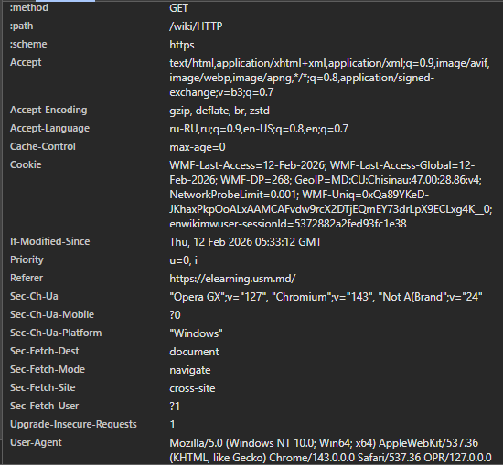
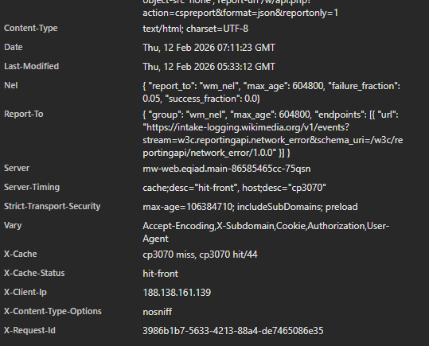
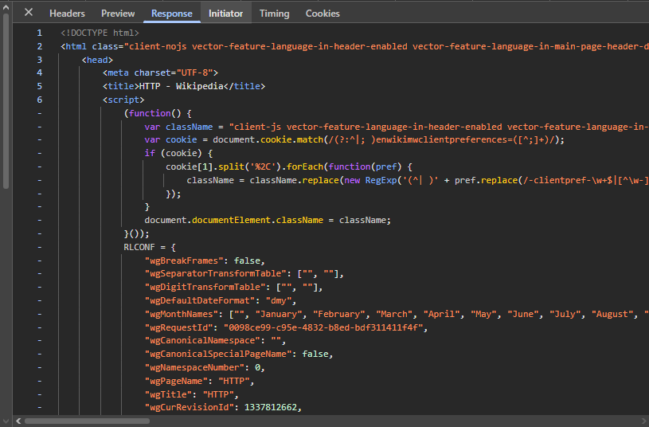
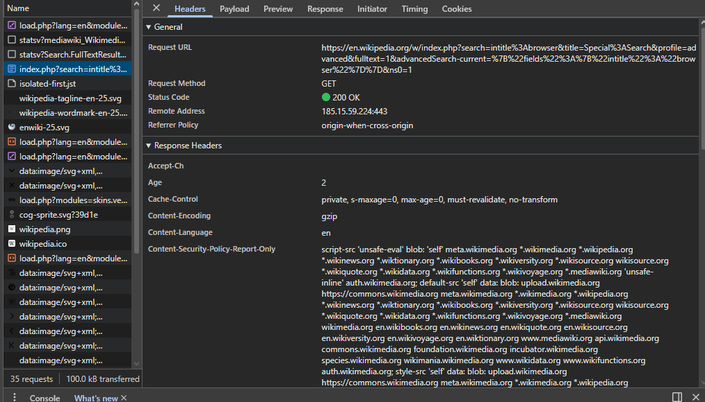
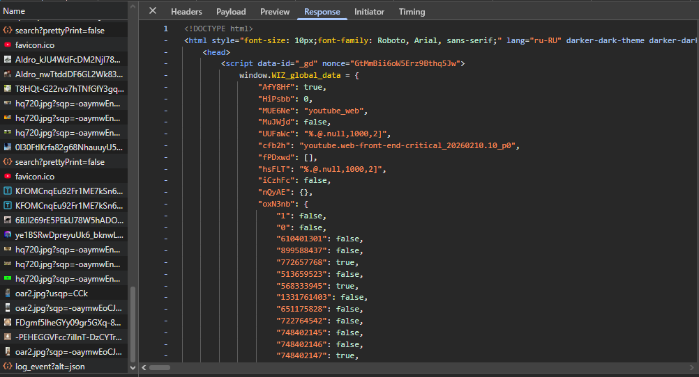

# Лабораторная работа №1 `Бурцева Дарья, IA2403`


## Задание 1. Анализ HTTP-запросов (Wikipedia: /wiki/HTTP)

**Сайт:** https://en.wikipedia.org/wiki/HTTP 

### 1) URL запроса

- **Request URL:** `https://en.wikipedia.org/wiki/HTTP`

### 2) Метод запроса и почему он используется
- **Request Method:** GET
- **Почему GET:** страница запрашивается для получения HTML-документа. GET применяется, когда нужно получить ресурс и не изменять состояние на сервере.

### 3) Статус ответа и что он означает
- **Status Code:** 200 OK
- **Значение:** сервер успешно обработал запрос и вернул содержимое страницы.

### 4) Заголовки запроса и ответа

#### Request Headers 



- `:method: GET`, `:path: /wiki/HTTP`, `:scheme: https`  
  Псевдозаголовки HTTP/2: метод, путь и схема запроса.

- `Accept: text/html,application/xhtml+xml,application/xml;q=0.9,image/avif,image/webp,image/apng,*/*;q=0.8,...`  
  Список типов контента, которые клиент готов принять. Приоритет задаётся через `q=`.

- `Accept-Encoding: gzip, deflate, br, zstd`  
  Какие алгоритмы сжатия поддерживает клиент (сервер выбирает подходящий и указывает в `Content-Encoding`).

- `Accept-Language: ru-RU,ru;q=0.9,en-US;q=0.8,en;q=0.7`  
  Предпочтения по языку интерфейса/контента.

- `Cache-Control: max-age=0`  
  Просьба не использовать “старый” кеш, а получить актуальную версию .

- `Cookie: WMF-Last-Access=..., WMF-Last-Access-Global=..., ... enwikimwuser-sessionid=...`  
  Куки Wikipedia/Wikimedia: служебные метки доступа, гео/настройки, идентификаторы сессии и т.п.

- `If-Modified-Since: Thu, 12 Feb 2026 05:33:12 GMT`  
  Условный заголовок кеширования: “если ресурс не менялся после этой даты, можно не присылать заново”.

- `Priority: u=0, i`  
  Подсказка приоритета загрузки (современные браузеры отправляют для оптимизации).

- `Referer: https://elearning.usm.md/`  
  Страница-источник перехода (откуда пришёл пользователь).


- `User-Agent: Mozilla/5.0 (Windows NT 10.0; Win64; x64) AppleWebKit/537.36 ... OPR/127.0.0.0`  
  Идентификация клиента: ОС Windows 10, браузер Opera/Chromium.

#### Response Headers




- `Accept-Ranges: bytes`  
  Поддержка частичных запросов для докачки/частичного получения данных.

- `Age: 42709`  
  Возраст ответа в кеше : сколько секунд объект уже хранится перед выдачей.

- `Cache-Control: private, s-maxage=0, max-age=0, must-revalidate, no-transform`  
  Политика кеширования: не считать ресурс свежим без перепроверки (`must-revalidate`), ограничения для shared cache (`s-maxage=0`), не изменять содержимое прокси (`no-transform`).

- `Content-Encoding: gzip`  
  Ответ сжат gzip.

- `Content-Language: en`  
  Язык содержимого: английский.

- `Content-Type: text/html; charset=UTF-8`  
  Тип данных: HTML-документ, кодировка UTF-8.

- `Date: Thu, 12 Feb 2026 07:11:23 GMT`  
  Время формирования/отправки ответа (по серверу).

- `Last-Modified: Thu, 12 Feb 2026 05:33:12 GMT`  
  Когда ресурс в последний раз изменялся (используется для кеширования и условных запросов).

- `NEL` и `Report-To`  
  Настройки Network Error Logging: куда браузер может отправлять отчёты о сетевых ошибках/нарушениях.

- `Server: mw-web.eqiad.main-...`  
  Идентификатор серверного узла/кластера Wikimedia .

- `Server-Timing: cache;desc="hit-front", host;desc="cp3070"`  
  Метрики обработки на стороне CDN/серверов: было ли попадание в кеш и на каком узле.

- `X-Client-IP: 188.138.161.139`  
  IP клиента, который видит инфраструктура.

- `X-Request-Id: 3986b1b7-...`  
  Идентификатор запроса для трассировки/логов.


### 5) Есть ли тело запроса или ответа
- **Request body:** у GET обычно отсутствует.
- **Response body:** присутствует — HTML-код страницы.



### 6) Какие ещё запросы отправляются при загрузке страницы и почему
При загрузке HTML браузер дополнительно запрашивает связанные ресурсы:
- `load.php?modules=...` — CSS/JS модули MediaWiki.
- `.svg`, `.png`, `wikipedia.png` — иконки/логотипы/графика интерфейса.
- `data:image/...` — встроенные ресурсы (в виде data URI).
Причина: HTML страницы ссылается на стили, скрипты, изображения, которые нужны для корректной отрисовки и работы интерфейса.

### 7) Переход на несуществующую страницу
**URL:** `https://en.wikipedia.org/wiki/HTTPdsfdfs`

- **Request Method:** GET
- **Status Code:** 404 Not Found


#### Почему 404:
 страница по указанному пути не существует на сервере, поэтому сервер сообщает, что не может найти документ.

---

## Задание 2. Анализ HTTP-запросов 



### 1) Поиск на Special:Search по слову `browser`
**Страница:** https://en.wikipedia.org/wiki/Special:Search  
**Действие:** поиск (пример) по слову browser

#### URL запроса (запрос страницы результатов поиска)

`https://en.wikipedia.org/w/index.php?search=intitle%3Abrowser&title=Special%3ASearch&profile=advanced&fulltext=1&advancedSearch-current=%7B%22fields%22%3A%7B%22intitle%22%3A%22browser%22%7D%7D&ns0=1`

#### 2) Метод запроса и почему он используется
- **Request Method:** GET
- **Почему GET:** поисковый запрос формируется в URL (query string), страница результатов должна открываться по ссылке, операция не изменяет состояние на сервере.

#### 3) Query Parameters (параметры и назначение)
- `search=intitle%3Abrowser` - ищет слово `browser` в заголовках страниц (оператор `intitle:`).

- `title=Special%3ASearch`- открывает спецстраницу поиска.

- `profile=advanced` - использует расширенный режим поиска.

- `fulltext=1` - режим “показать результаты поиска” (полнотекстовый поиск).

---

## Задание 3. Анализ HTTP-запроса (сайт на выбор: YouTube)




**Выбран сайт:** https://www.youtube.com  
**Действие:** поиск по слову `cat`  
**Основной запрос документа страницы результатов:**
- **Request URL:** `https://www.youtube.com/results?search_query=cat`
- **Request Method:** GET
- **Status Code:** 200 OK (from service worker)

### Query Parameters
- `search_query=cat` — строка поиска, по которой формируются результаты.

### Заголовки ответа
- `content-encoding: br` — сжатие Brotli.
- `content-type: text/html; charset=utf-8` — сервер вернул HTML документ.
- `cache-control: no-cache, no-store, max-age=0, must-revalidate` — строгие правила хранения/переиспользования (динамический контент).

---

## Задание 4. Составление HTTP-запросов и контрольные вопросы

### 4.1. GET-запрос на `http://sandbox.usm.com` с User-Agent = “Daria Burteva”
```http
GET / HTTP/1.1
Host: sandbox.usm.com
User-Agent: Daria Burteva
```

````markdown


### 4.2. Что такое User-Agent и для чего он используется?

**User-Agent** — это HTTP-заголовок, который сообщает серверу информацию о клиенте.

Используется для:

* определения типа клиента (браузер, мобильное приложение);
* выдачи разных версий сайта (мобильная/десктопная);
* совместимости и включения/отключения функций под конкретные клиенты;
* диагностики проблем.

### 4.3. POST-запрос на `http://sandbox.usm.com/cars` с параметрами `make`, `model`, `year`

```http
POST /cars HTTP/1.1
Host: sandbox.usm.com

make=Toyota&model=Corolla&year=2020
```


### 4.4. Какие ещё методы HTTP-запросов существуют и для чего они используются?

* **GET** — получить ресурс.
* **POST** — отправить данные (часто создать ресурс или запустить обработку).
* **PUT** — создать или полностью заменить ресурс по конкретному URI.
* **PATCH** — частично изменить ресурс.
* **DELETE** — удалить ресурс.
* **HEAD** — получить только заголовки (как GET, но без тела ответа).
* **OPTIONS** — узнать доступные методы/настройки.
* **TRACE** — диагностика маршрута запроса.
* **CONNECT** — установить туннель.

### 4.5. PUT-запрос на `http://sandbox.usm.com/cars/1` с JSON телом

```http
PUT /cars/1 HTTP/1.1
Host: sandbox.usm.com

{
  "make": "Toyota",
  "model": "Corolla",
  "year": 2021
}
```

### 4.6. В чём разница между PATCH и PUT?

* **PUT** — обычно полная замена ресурса: отправляется “полная версия” объекта.
* **PATCH** — частичное обновление: изменяются только указанные поля, остальные остаются прежними.

### 4.7. Один из возможных вариантов ответа сервера на запрос `POST /cars ...`

Запрос:

```http
POST /cars HTTP/1.1
Host: sandbox.com
Content-Type: application/json
User-Agent: John Doe

model=Corolla&make=Toyota&year=2020
```

Возможный ответ:

```http
HTTP/1.1 201 Created
Content-Type: application/json
Location: /cars/42

{"id":42,"make":"Toyota","model":"Corolla","year":2020}
```

### 4.8. Ситуации, когда сервер может вернуть 200, 201, 400, 401, 403, 404, 500

* **200 OK** — запрос обработан успешно.
* **201 Created** — ресурс успешно создан.
* **400 Bad Request** — неверный формат запроса/данных.
* **401 Unauthorized** — требуется авторизация, но её нет или она неверна.
* **403 Forbidden** — авторизация есть, но прав на операцию нет.
* **404 Not Found** — endpoint не существует на указанном хосте или неверный путь.
* **500 Internal Server Error** — ошибка на стороне сервера.


