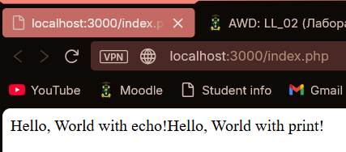
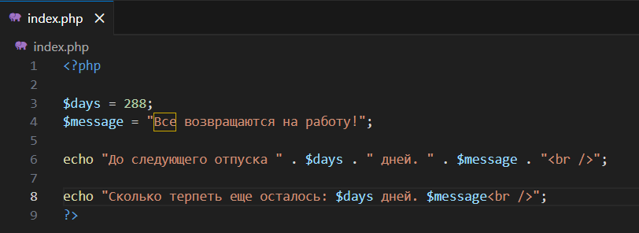

# Лабораторная работа №2. Установка и первая программа на PHP `Бурцева Дарья, IA2403`

## Цель работы
Установить и настроить среду разработки для PHP, проверить корректность установки, освоить базовый вывод, переменные и способы форматирования вывода в браузере.

## Ход работы

### Шаг 1. Установка PHP (ручной способ)

1. Перейти на официальный сайт PHP: https://www.php.net/downloads  
2. Скачать актуальную версию PHP под свою ОС.
3. Распаковать архив.
4. Добавить путь к PHP в переменную среды **Path**:
   - Win + R → sysdm.cpl
   - вкладка **Дополнительно** → **Переменные среды**
   - в **Системные переменные** выбрать Path → **Изменить**
   - добавить: C:\Program Files\php
   - сохранить изменения


5. Проверить установку в командной строке:
```
   php -v
````


---

### Шаг 2. Написание первой PHP-программы

1. Создать директорию проекта.
2. Создать файл `index.php` и открыть его в редакторе.
3. Вставить код:

   ```
   <?php
   echo "Привет, мир!";
   ```
4. Запуск программы:


---

### Шаг 3. Вывод данных в PHP (echo и print)

Код для проверки вывода двумя способами:

```
<?php
echo "Hello, World with echo!";
print "Hello, World with print!";
?>
```



---

### Шаг 4. Работа с переменными и выводом

**Задание:** создать две переменные и вывести их разными способами, используя `<br />`.

Код:



Результат:


---

## Контрольные вопросы и ответы

### 1) Какие способы установки PHP существуют?

1. **Ручная установка**: скачать PHP с официального сайта, распаковать, добавить путь в Path.
2. **Через готовые сборки/пакеты**: например, XAMPP, где PHP идет вместе с Apache и phpMyAdmin.

### 2) Как проверить, что PHP установлен и работает?

Открыть командную строку и выполнить:

  ```
  php -v
  ```

  Если команда возвращает версию PHP, значит установка корректна.


### 3) Чем отличается оператор echo от print?

* `echo` не возвращает значение и может принимать несколько аргументов (через запятую).
* `print` возвращает `1` (поэтому его можно использовать в выражениях) и принимает только один аргумент.
* В повседневной практике чаще используют `echo`, потому что он проще.

---

## Вывод

В ходе лабораторной работы была установлена и проверена среда для разработки на PHP, создан и запущен первый PHP-скрипт, изучены базовые способы вывода (`echo`, `print`), а также работа с переменными и форматирование вывода с помощью `<br />`.