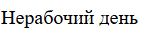
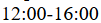
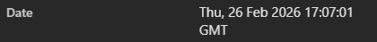
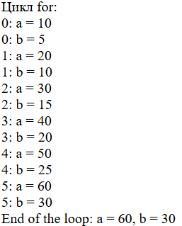
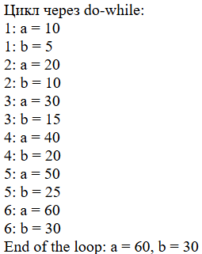
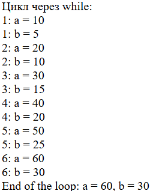

# Лабораторная работа №3. Управляющие конструкции `Бурцева Дарья, IA2403`

## Цель работы
Освоить базовые управляющие конструкции PHP: условные операторы (if/else, тернарный оператор) и циклы (for, while, do-while), а также закрепить работу с функцией `date()`.

## Задание
1. С помощью `date()` сформировать таблицу расписания на основе текущего дня недели:
   - **John Styles**: Пн/Ср/Пт → `8:00-12:00`, иначе → `Нерабочий день`.
   - **Jane Doe**: Вт/Чт/Сб → `12:00-16:00`, иначе → `Нерабочий день`.
2. Для цикла `for` вывести промежуточные значения `$a` и `$b` на каждом шаге.
3. Переписать этот цикл с использованием `while` и `do-while`.
4. Ответить на контрольные вопросы.

---

## Ход выполнения

### 1) Условные конструкции: расписание по дню недели

```
$day = date('w');
if ($day == 1 || $day == 3 || $day == 5)
  echo "8:00-12:00";
else 
    echo "Нерабочий день"; 
```

Результат:



```
if ($day == 2 || $day == 4 || $day == 6)
  echo "12:00-16:00";
else 
    echo "Нерабочий день";
```

Результат:



Примечание: `date('w')` возвращает номер дня недели.

На момент выполнения лабораторной работы время на сервере было:



---

### 2) Циклы: `for` + промежуточные значения

```
echo "Цикл for:";

$a = 0;
$b = 0;

for ($i = 0; $i <= 5; $i++) {
   $a += 10;
   $b += 5;

   echo "$i: a = $a";

   echo "$i: b = $b";
}
   echo "End of the loop: a = $a, b = $b";

```

Результат:



---

### 3) Переписывание цикла через `do-while`

```
 echo "Цикл через do-while:";

$a = 0;
$b = 0;
$i = 0;

   do {
      $i++;
      $a += 10;
      $b += 5;

   echo "$i: a = $a";

   echo "$i: b = $b";

} while ($i <= 5);

   echo "End of the loop: a = $a, b = $b";

```

Результат:



---

### 4) Переписывание цикла через `while`

```
echo "Цикл через while:";

$i = 0;
$a = 0;
$b = 0;

 while ($i <= 5) {

      $i++;
      $a += 10;
      $b += 5;

   echo "$i: a = $a";

   echo "$i: b = $b";

}

echo "End of the loop: a = $a, b = $b";
```

Результат:



---

## Контрольные вопросы

1. **В чем разница между циклами for, while и do-while? Когда какой лучше использовать?**  
   `for` удобен, когда заранее известно количество повторений.  
   `while` удобен, когда количество повторений заранее неизвестно, условие проверяется до тела.  
   `do-while` гарантирует выполнение тела хотя бы один раз, условие проверяется после.  

3. **Как работает тернарный оператор `? :` в PHP?**
   Это короткая форма `if/else: условие ? значение_если_true : значение_если_false;`
   Пример:
   `$x = ($day == 1) ? "Пн" : "Не Пн";`

4. **Что произойдет, если в do-while поставить условие, которое изначально ложно?**
   Тело цикла всё равно выполнится один раз, и только потом условие проверится и цикл завершится.

---

## Вывод

В ходе работы были реализованы условные конструкции для формирования расписания по текущему дню недели с использованием `date('w')`, а также изучены и сравнены циклы `for`, `while`, `do-while` на примере накопления значений и вывода промежуточных результатов.

---

## Библиография

1. Курс Moodle "Advanced Web Development (PHP)"
   [https://elearning.usm.md/course/view.php?id=7161](https://elearning.usm.md/course/view.php?id=7161)
2. Синтаксис `date`
   [https://www.php.net/manual/ru/function.date.php](https://www.php.net/manual/ru/function.date.php)
3. Синтаксис `if`
   [https://www.php.net/manual/ru/control-structures.if.php](https://www.php.net/manual/ru/control-structures.if.php)
4. Перенос строки в PHP
   [https://ru.stackoverflow.com/questions/21570/Перенос-строки](https://ru.stackoverflow.com/questions/21570/Перенос-строки)
5. Цикл `for, while и do while`. Операторы циклов

   [https://itproger.com/course/php-mysql/9](https://itproger.com/course/php-mysql/9)
