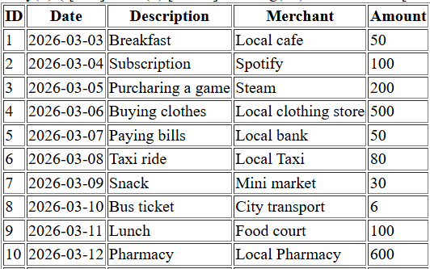
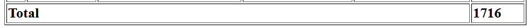
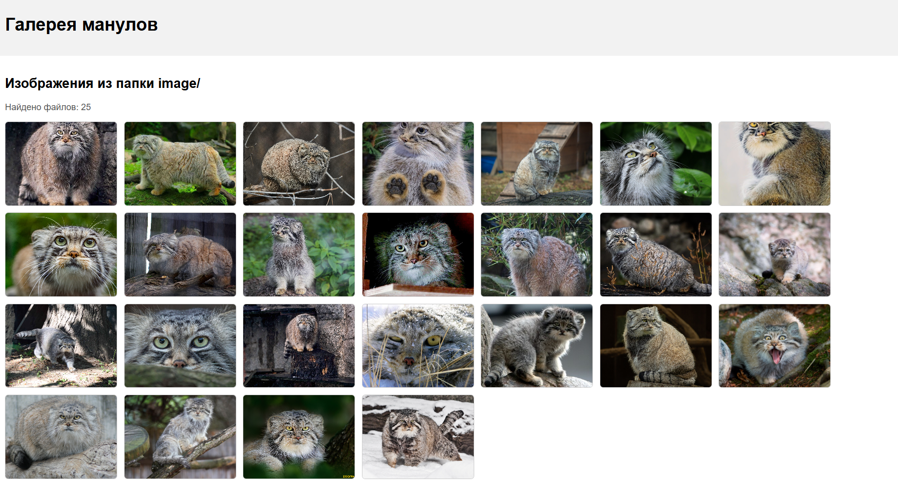

# Лабораторная работа №4. Массивы и функции `Бурцева Дарья, IA2403`

## Цель работы

Освоить работу с массивами в PHP, применяя операции создания, добавления, удаления, сортировки и поиска. Закрепить навыки работы с функциями: передача аргументов, возвращаемые значения, анонимные функции.

## Условие

Разработать систему управления банковскими транзакциями с возможностью:

* добавления новых транзакций;
* удаления транзакций;
* сортировки по дате или сумме;
* поиска транзакций по описанию.

Дополнительно: работа с файловой системой и вывод изображений из директории `image` в виде галереи.

---

## Ход выполнения работы

### 1.1. Подготовка среды

1. Установлен PHP версии 8+.

2. Создан файл `index.php`.  
3. Включена строгая типизация:

```php
<?php
declare(strict_types=1);
```

---

### 1.2. Создание массива транзакций

Создан массив `$transactions`, где каждая транзакция является ассоциативным массивом с полями `id`, `date`, `amount`, `description`, `merchant`.

Пример:

```php
$transactions = [
[
    'id' => 1,
    'date' => '2026-03-03',
    'amount' => 50.00,
    'description' => 'Breakfast',
    'merchant' => 'Local cafe',
],
[
    'id' => 2,
    'date' => '2026-03-04',
    'amount' => 100.00,
    'description' => 'Subscription',
    'merchant' => 'Spotify',
],
[
    'id' => 3,
    'date' => '2026-03-05',
    'amount' => 200.00,
    'description' => 'Purcharing a game',
    'merchant' => 'Steam',
],
[
    'id' => 4,
    'date' => '2026-03-06',
    'amount' => 500.00,
    'description' => 'Buying clothes',
    'merchant' => 'Local clothing store',
],
[
    'id' => 5,
    'date' => '2026-03-07',
    'amount' => 50.00,
    'description' => 'Paying bills',
    'merchant' => 'Local bank',
],
[
    'id' => 6,
    'date' => '2026-03-08',
    'amount' => 80.00,
    'description' => 'Taxi ride',
    'merchant' => 'Local Taxi',
],
[
    'id' => 7,
    'date' => '2026-03-09',
    'amount' => 30.00,
    'description' => 'Snack',
    'merchant' => 'Mini market',
],
[
    'id' => 8,
    'date' => '2026-03-10',
    'amount' => 6.00,
    'description' => 'Bus ticket',
    'merchant' => 'City transport',
],
[
    'id' => 9,
    'date' => '2026-03-11',
    'amount' => 100.00,
    'description' => 'Lunch',
    'merchant' => 'Food court',
],
[
    'id' => 10,
    'date' => '2026-03-12',
    'amount' => 600.00,
    'description' => 'Pharmacy',
    'merchant' => 'Local Pharmacy',
],
];
```

---

### 1.3. Вывод списка транзакций (foreach + HTML-таблица)

```php
<table border="1">
    <thead>
        <tr>
            <th>ID</th>
            <th>Date</th>
            <th>Days Since Transaction</th>
            <th>Description</th>
            <th>Merchant</th>
            <th>Amount</th>
        </tr>
    </thead>
    <tbody>
        <?php foreach ($transactions as $t) { ?>
            <tr>
                <td><?= $t['id'] ?></td>
                <td><?= $t['date'] ?></td>
                <td><?= $t['description'] ?></td>
                <td><?= $t['merchant'] ?></td>
                <td><?= $t['amount'] ?></td>
            </tr>
        <?php } ?>
        </tr>
    </tbody>
</table>
```

Результат:



---

### 1.4. Реализация функций

#### Функция calculateTotalAmount(array $transactions): float

Создаем функцию `calculateTotalAmount(array $transactions): float`, которая вычисляет общую сумму всех транзакций. 

Выводим сумму всех транзакций в конце таблицы.

```php
function calculateTotalAmount(array $transactions): float
{
    $total = 0.0;
    foreach ($transactions as $t) {
        $total += (float)$t['amount'];
    }
    return $total;
}

$totalAmount = calculateTotalAmount($transactions);
```

```html
<tr>
    <td colspan="5"><strong>Total</strong></td>
    <td><strong><?= $totalAmount ?></strong></td>
</tr>
```

Результат:



#### Функция findTransactionByDescription(string $descriptionPart)

Создаем функцию findTransactionByDescription(string $descriptionPart), которая ищет транзакцию по части описания.

```php
function findTransactionByDescription(string $descriptionPart, array $transactions): ?array
{
    $matches = [];

    foreach ($transactions as $t) {
        $matches[] = stripos($t['description'], $descriptionPart) !== false;
    }

    $index = array_search(true, $matches, true);

    if ($index === false) {
        return null;
    }

    return $transactions[$index];
}

#пример
$found = findTransactionByDescription('bill', $transactions);

if ($found) {
    echo $found['description'];
} else {
    echo "Не найдено";
}
```

Результат:


#### Функция findTransactionById(int $id)

Создаем функцию findTransactionById(int $id), которая ищет транзакцию по идентификатору:

1. C помощью обычного цикла `foreach`

```php
function findTransactionByIdForeach(int $id, array $transactions): ?array
{
    foreach ($transactions as $t) {
        if ($t['id'] === $id) {
            return $t;
        }
    }
    return null;
}

#пример
$found1 = findTransactionByIdForeach(2, $transactions);
```

2. C помощью функции array_filter

```php
function findTransactionByIdFilter(int $id, array $transactions): ?array
{
    $filtered = array_filter($transactions, function (array $t) use ($id) {
        return $t['id'] === $id;
    });

    if (empty($filtered)) {
        return null;
    }

    return array_values($filtered)[0];
}

#пример
$found2 = findTransactionByIdFilter(5, $transactions);
```

Результат:


#### Функция daysSinceTransaction(string $date): int

Создаем функцию `daysSinceTransaction(string $date): int`, которая возвращает количество дней между датой транзакции и текущим днем.  

Добавляем в таблицу столбец с количеством дней с момента транзакции.

```php
function daysSinceTransaction(string $date): int
{
    $tDate = new DateTime($date);
    $today  = new DateTime('today');

    return (int)$tDate->diff($today)->format('%r%a');
}
```

```html
<td><?= daysSinceTransaction($t['date']) ?></td>
```

Результат:


#### Функция addTransaction(...) с глобальной переменной

Создаем функцию `addTransaction(int $id, string $date, float $amount, string $description, string $merchant): void` для добавления новой транзакции.

```php
function addTransaction(int $id, string $date, float $amount, string $description, string $merchant): void
{
    global $transactions;

    $transactions[] = [
        'id' => $id,
        'date' => $date,
        'description' => $description,
        'merchant' => $merchant,
        'amount' => $amount,
    ];
}

#пример
addTransaction(11, '2026-03-13', 1500.00, 'Shoes', 'Sport store');
```
Результат:


---

### 1.5. Сортировка транзакций (usort)

#### Сортировка по дате (по возрастанию)

```php
usort($transactions, function (array $a, array $b): int {
return strtotime($b['date']) <=> strtotime($a['date']); 
});
```

Результат:


#### Сортировка по сумме (по убыванию)

```php
usort($transactions, function (array $a, array $b): int {
return $b['amount'] <=> $a['amount'];
});
```

Результат:


---

## 2. Работа с файловой системой: галерея изображений

### 2.1. Подготовка директории

1. Создана папка `image`.
2. В папку добавлено 25 файлов с расширением `.jpg`.

### 2.2. Вывод изображений на веб-страницу

Создана `html` страница, изображения выводятся галереей.

```php
<?php
declare(strict_types=1);

$dir = __DIR__ . '/image/';    
$webDir = 'image/';             

$files = scandir($dir);

$images = [];
foreach ($files as $file) {
    if ($file === '.' || $file === '..') {
        continue;
    }
    $ext = strtolower(pathinfo($file, PATHINFO_EXTENSION));
    if ($ext === 'jpg' || $ext === 'jpeg') {
        $images[] = $file;
    }
}
?>
<!doctype html>
<html lang="ru">
<head>
    <meta charset="utf-8">
    <style>
        body { font-family: Arial, sans-serif; margin: 0; }
        header, footer { padding: 16px; background: #f2f2f2; }
        nav { padding: 10px 16px; background: #ddd; }
        nav a { margin-right: 12px; text-decoration: none; color: #000; }
        main { padding: 16px; }
        .gallery { display: flex; flex-wrap: wrap; gap: 12px; }
        .gallery img {
            width: 200px; height: 150px; object-fit: cover;
            border: 1px solid #ccc; border-radius: 6px;
        }
        .note { color: #555; }
    </style>
</head>
<body>

<header>
    <h1>Галерея манулов</h1>
</header>

<main>
    <h2 id="gallery">Изображения из папки image/</h2>
    <p class="note">Найдено файлов: <?= count($images) ?></p>

    <div class="gallery">
        <?php foreach ($images as $img): ?>
            " alt="<?= htmlspecialchars($img) ?>">
        <?php endforeach; ?>
    </div>


</main>
</body>
</html>
```

Результат:




---

## Контрольные вопросы

1. Что такое массивы в PHP?  
   Массив в PHP - это структура данных для хранения набора значений. Массивы бывают индексные (ключи 0,1,2...) и ассоциативные (ключи строковые, например `'id' => 5`). Внутри массива можно хранить числа, строки, другие массивы и т.д.

2. Каким образом можно создать массив в PHP?
   Массив создаётся с помощью `[]` или `array()`:

* `$a = [1, 2, 3];`
* `$b = array('id' => 1, 'name' => 'Test');`

3. Для чего используется цикл foreach?  
   `foreach` используется для перебора массива: он проходит по каждому элементу и позволяет удобно получать значения (и при необходимости ключи). Особенно полезен для ассоциативных массивов и массивов объектов.

---

## Выводы

В ходе работы был создан массив транзакций и реализованы основные операции управления данными: вывод в HTML-таблицу, подсчёт общей суммы, поиск по описанию и идентификатору, вычисление количества дней с даты транзакции, добавление новых транзакций и сортировка по дате/сумме с использованием `usort`. Дополнительно была реализована галерея изображений, в которой файлы `.jpg` выводятся со сканированием директории через `scandir` и определением расширения через `pathinfo`.

---

## Библиография

1. Документация PHP: Массивы  
https://www.php.net/manual/ru/language.types.array.php

2. Документация PHP: foreach  
https://www.php.net/manual/ru/control-structures.foreach.php

3. Документация PHP: пользовательские функции 
https://www.php.net/manual/ru/functions.user-defined.php

4. Документация PHP: array_search  
https://www.php.net/manual/ru/function.array-search.php

5. Документация PHP: stripos  
https://www.php.net/manual/ru/function.stripos.php

6. Документация PHP: date  
https://www.php.net/manual/ru/function.date.php

7. Документация PHP: usort  
https://www.php.net/manual/ru/function.usort.php

8. Документация PHP: Операторы сравнения 
https://www.php.net/manual/ru/language.operators.comparison.php

9. Курс Moodle "Advanced Web Development (PHP)"
https://elearning.usm.md/course/view.php?id=7161
---
