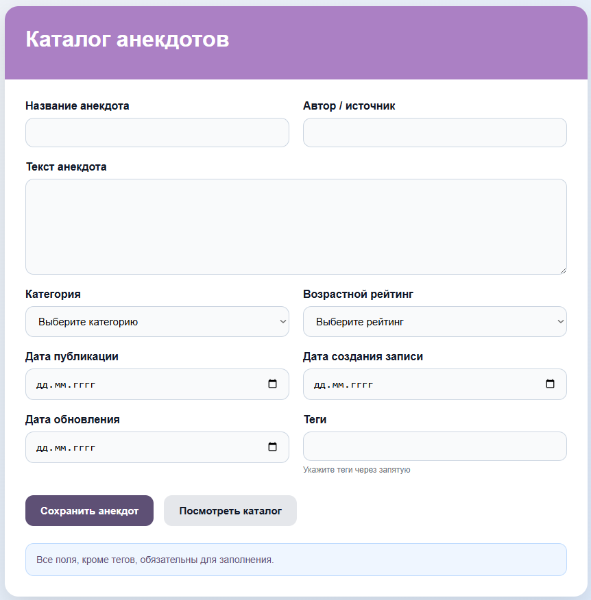
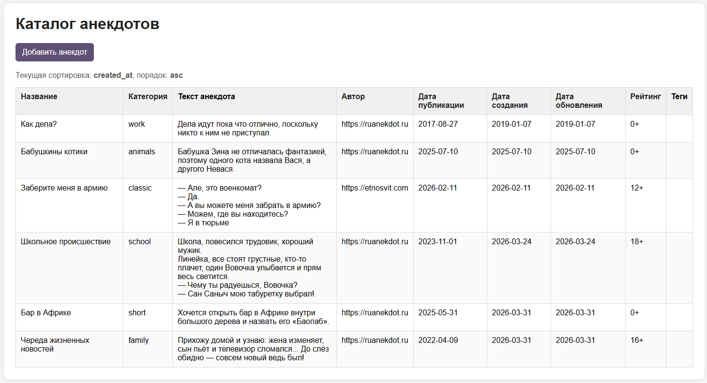

# Лабораторная работа №6. Обработка и валидация форм `Бурцева Дарья, IA2403`

## Цель работы

Освоить основные принципы работы с HTML-формами в PHP, включая отправку данных на сервер, обработку данных, их валидацию, сохранение в файл и вывод информации в удобном для пользователя виде.

---

## Постановка задачи

В рамках лабораторной работы необходимо разработать небольшое веб-приложение на PHP по выбранной теме.  
В данной работе была выбрана тема **«Каталог анекдотов»**.

Приложение должно обеспечивать:

- создание новой записи через HTML-форму;
- отправку данных методом `POST`;
- серверную обработку и валидацию данных;
- сохранение записей в файл в читаемом формате;
- отображение всех записей в виде HTML-таблицы;
- сортировку данных по выбранным полям;
- расширяемую архитектуру валидации с использованием интерфейса.

---

## Шаг 1. Определение модели данных

Для темы **«Каталог анекдотов»** была определена следующая модель данных

| Поле | Тип | Описание |
|------|-----|----------|
| `title` | `string` | Название анекдота |
| `content` | `text` | Полный текст анекдота |
| `category` | `enum` | Категория анекдота |
| `author` | `string` | Автор или источник |
| `publish_date` | `date` | Дата публикации |
| `created_at` | `date` | Дата создания записи |
| `updated_at` | `date` | Дата обновления записи |
| `rating` | `enum` | Возрастной рейтинг |
| `tags` | `string` | Теги для поиска и группировки |

Требования задания выполнены:

- используется более 6 полей
- есть поле типа `string`
- есть поле типа `date`
- есть поле типа `enum`
- есть поле типа `text`

### Используемые значения перечислений

**Категория (`category`):**
- `short` - короткий
- `family` - семейный
- `school` - школьный
- `work` - про работу
- `animals` - про животных
- `classic` - классический

**Возрастной рейтинг (`rating`):**
- `0+`
- `12+`
- `16+`
- `18+`


---

## Шаг 2. Создание HTML-формы

Для ввода новой записи была разработана HTML-форма `index.html`.  
Форма содержит все поля, соответствующие модели данных, использует метод `POST` и отправляет данные в файл `save_joke.php`.

### Основные особенности формы

- обязательные поля отмечены атрибутом `required`;
- для текстовых полей заданы ограничения `minlength` и `maxlength`;
- для даты используется тип `date`;
- для перечислений применяются элементы `<select>`;
- для длинного текста используется `<textarea>`;
- форма оформлена с помощью CSS для улучшения внешнего вида.

### Код HTML-формы

```html
<form action="save_joke.php" method="POST">
    <label for="title">Название анекдота</label>
    <input
        type="text"
        id="title"
        name="title"
        required
        minlength="3"
        maxlength="100"
    >

    <label for="content">Текст анекдота</label>
    <textarea
        id="content"
        name="content"
        required
        minlength="10"
        maxlength="2000"
    ></textarea>

    <label for="category">Категория</label>
    <select id="category" name="category" required>
        <option value="">Выберите категорию</option>
        <option value="short">Короткий</option>
        <option value="family">Семейный</option>
        <option value="school">Школьный</option>
        <option value="work">Про работу</option>
        <option value="animals">Про животных</option>
        <option value="classic">Классический</option>
    </select>

    <label for="author">Автор / источник</label>
    <input
        type="text"
        id="author"
        name="author"
        required
        minlength="2"
        maxlength="100"
    >

    <label for="publish_date">Дата публикации</label>
    <input type="date" id="publish_date" name="publish_date" required>

    <label for="rating">Возрастной рейтинг</label>
    <select id="rating" name="rating" required>
        <option value="">Выберите рейтинг</option>
        <option value="0+">0+</option>
        <option value="12+">12+</option>
        <option value="16+">16+</option>
        <option value="18+">18+</option>
    </select>

    <button type="submit">Сохранить анекдот</button>
</form>
````



---

## Шаг 3. Обработка данных на сервере

Для обработки формы был создан PHP-скрипт `save_joke.php`.
Он выполняет следующие действия:

1. принимает данные из массива `$_POST`
2. запускает серверную валидацию
3. при отсутствии ошибок сохраняет запись в файл `data.txt`
4. выводит сообщение об успехе или список ошибок

Для хранения данных был выбран формат **JSON **: одна JSON-запись на одну строку файла. Это удобно для чтения, обработки и последующего отображения.

### Обработчик формы

```php
<?php
declare(strict_types=1);

require_once __DIR__ . '/src/JokeValidator.php';

if ($_SERVER['REQUEST_METHOD'] !== 'POST') {
    die('Ошибка: данные должны отправляться методом POST.');
}

$validator = new JokeValidator($_POST);

if (!$validator->validate()) {
    echo '<h2>Ошибки валидации:</h2>';
    echo '<ul>';

    foreach ($validator->errors() as $fieldErrors) {
        foreach ($fieldErrors as $error) {
            echo '<li>' . htmlspecialchars($error, ENT_QUOTES, 'UTF-8') . '</li>';
        }
    }

    echo '</ul>';
    exit;
}

$joke = $validator->validated();
$jsonLine = json_encode($joke, JSON_UNESCAPED_UNICODE);

file_put_contents('data.txt', $jsonLine . PHP_EOL, FILE_APPEND | LOCK_EX);

echo '<h2>Анекдот успешно сохранён!</h2>';
?>
```

### Пример данных в файле `data.txt`

```json
{"title":"Анекдот про школу","content":"Учитель спрашивает: почему опоздал? Ученик: потому что звонок прозвенел раньше.","category":"school","author":"Народный","publish_date":"2026-03-31","created_at":"2026-03-31","updated_at":"2026-03-31","rating":"12+","tags":"школа,учитель"}
```

---

## Шаг 4. Вывод данных

Для отображения сохранённых записей был создан файл `list_jokes.php`.

Скрипт выполняет следующие действия:

* читает файл `data.txt`
* построчно разбирает JSON-записи
* формирует массив анекдотов
* сортирует данные по выбранному полю
* выводит результат в виде HTML-таблицы
* оформляет таблицу с помощью CSS

### Функция чтения данных

```php
<?php
/**
 * Читает записи анекдотов из файла.
 *
 * @param string $filename Имя файла.
 * @return array<int, array<string, string>>
 */
function readJokesFromFile(string $filename): array
{
    if (!file_exists($filename)) {
        return [];
    }

    $lines = file($filename, FILE_IGNORE_NEW_LINES | FILE_SKIP_EMPTY_LINES);
    $jokes = [];

    foreach ($lines as $line) {
        $decoded = json_decode($line, true);

        if (is_array($decoded)) {
            $jokes[] = $decoded;
        }
    }

    return $jokes;
}
?>
```

### Функция сортировки

```php
<?php
/**
 * Сортирует массив анекдотов по указанному полю.
 *
 * @param array<int, array<string, string>> $jokes
 * @param string $sortBy
 * @param string $order
 * @return array<int, array<string, string>>
 */
function sortJokes(array $jokes, string $sortBy, string $order): array
{
    usort($jokes, function (array $a, array $b) use ($sortBy, $order): int {
        $valueA = $a[$sortBy] ?? '';
        $valueB = $b[$sortBy] ?? '';
        $result = strcmp((string)$valueA, (string)$valueB);

        return $order === 'desc' ? -$result : $result;
    });

    return $jokes;
}
?>
```

### Вывод таблицы

```php
<table>
    <thead>
        <tr>
            <th><a href="?sort=title&order=asc">Название</a></th>
            <th><a href="?sort=category&order=asc">Категория</a></th>
            <th>Текст</th>
            <th><a href="?sort=author&order=asc">Автор</a></th>
            <th><a href="?sort=created_at&order=asc">Дата создания</a></th>
        </tr>
    </thead>
    <tbody>
        <?php foreach ($jokes as $joke): ?>
            <tr>
                <td><?= htmlspecialchars($joke['title'] ?? '', ENT_QUOTES, 'UTF-8') ?></td>
                <td><?= htmlspecialchars($joke['category'] ?? '', ENT_QUOTES, 'UTF-8') ?></td>
                <td><?= htmlspecialchars($joke['content'] ?? '', ENT_QUOTES, 'UTF-8') ?></td>
                <td><?= htmlspecialchars($joke['author'] ?? '', ENT_QUOTES, 'UTF-8') ?></td>
                <td><?= htmlspecialchars($joke['created_at'] ?? '', ENT_QUOTES, 'UTF-8') ?></td>
            </tr>
        <?php endforeach; ?>
    </tbody>
</table>
```



---

## Шаг 5. Дополнительная функция

Для получения максимальной оценки была реализована дополнительная функция:
**добавление интерфейса для валидаторов**.

Был создан интерфейс `ValidatorInterface`, который задаёт единый контракт для всех валидаторов приложения. Это делает архитектуру более расширяемой и позволяет при необходимости создавать новые классы валидаторов с одинаковым набором методов.

### Интерфейс валидатора

```php
<?php
declare(strict_types=1);

/**
 * Интерфейс для валидаторов.
 */
interface ValidatorInterface
{
    /**
     * Выполняет валидацию данных.
     *
     * @return bool
     */
    public function validate(): bool;

    /**
     * Возвращает массив ошибок.
     *
     * @return array<string, array<int, string>>
     */
    public function errors(): array;

    /**
     * Возвращает проверенные данные.
     *
     * @return array<string, mixed>
     */
    public function validated(): array;
}
?>
```

### Класс валидатора формы

```php
<?php
declare(strict_types=1);

require_once __DIR__ . '/ValidatorInterface.php';

/**
 * Валидатор формы добавления анекдота.
 */
class JokeValidator implements ValidatorInterface
{
    private array $data;
    private array $errors = [];
    private array $validated = [];

    private array $allowedCategories = ['short', 'family', 'school', 'work', 'animals', 'classic'];
    private array $allowedRatings = ['0+', '12+', '16+', '18+'];

    /**
     * @param array<string, mixed> $data
     */
    public function __construct(array $data)
    {
        $this->data = $data;
    }

    public function validate(): bool
    {
        $title = trim((string)($this->data['title'] ?? ''));
        $content = trim((string)($this->data['content'] ?? ''));
        $category = trim((string)($this->data['category'] ?? ''));

        if ($title === '') {
            $this->errors['title'][] = 'Название обязательно для заполнения.';
        }

        if ($content === '') {
            $this->errors['content'][] = 'Текст анекдота обязателен.';
        }

        if ($category === '' || !in_array($category, $this->allowedCategories, true)) {
            $this->errors['category'][] = 'Категория указана неверно.';
        }

        if (empty($this->errors)) {
            $this->validated = [
                'title' => $title,
                'content' => $content,
                'category' => $category,
            ];
        }

        return empty($this->errors);
    }

    public function errors(): array
    {
        return $this->errors;
    }

    public function validated(): array
    {
        return $this->validated;
    }
}
?>
```

### Преимущества такого подхода

* единый интерфейс для всех валидаторов
* возможность расширения проекта
* более понятная структура приложения
* соответствие принципам объектно-ориентированного программирования

---

## Контрольные вопросы

### 1. Какие существуют методы отправки данных из формы на сервер? Какие методы поддерживает HTML-форма?

Основные методы отправки данных из формы на сервер - это **GET** и **POST**.

* **GET** передаёт данные через адресную строку URL.
  Такой метод удобно использовать для поиска, фильтрации и переходов по параметрам, так как данные видны в адресной строке.

* **POST** передаёт данные в теле HTTP-запроса.
  Этот метод обычно используется для отправки форм, содержащих пользовательские данные, например регистрацию, авторизацию, добавление записей.

HTML-форма поддерживает методы:

* `GET`
* `POST`

### 2. Какие глобальные переменные используются для доступа к данным формы в PHP?

Для доступа к данным формы в PHP используются суперглобальные массивы:

* `$_GET` - данные, отправленные методом GET;
* `$_POST` - данные, отправленные методом POST;
* `$_REQUEST` - объединяет данные из `$_GET`, `$_POST` и `$_COOKIE`.

На практике чаще всего используют именно `$_GET` и `$_POST`, так как они более явные и безопасные с точки зрения логики приложения.

### 3. Как обеспечить безопасность при обработке данных из формы (например, защититься от XSS)?

Для защиты от XSS и других проблем безопасности необходимо:

* проверять обязательные поля и допустимые значения
* экранировать данные перед выводом в HTML с помощью `htmlspecialchars()`
* ограничивать длину вводимых значений
* использовать строгую проверку типов и допустимых форматов
* не доверять данным только из клиентской валидации
* при работе с файлами и базами данных дополнительно контролировать формат и структуру данных

---

## Вывод

В результате выполнения лабораторной работы были изучены основные принципы работы HTML-форм и их обработки в PHP. Были освоены способы передачи данных методом `POST`, получение значений через суперглобальный массив `$_POST`, выполнение клиентской и серверной валидации, а также безопасный вывод данных с использованием `htmlspecialchars()`.

Практическая часть работы позволила реализовать полноценное приложение для добавления и просмотра записей по выбранной теме. Также была реализована дополнительная функция в виде интерфейса для валидаторов, что сделало структуру проекта более гибкой и расширяемой. Полученные навыки могут быть использованы при разработке более сложных PHP-приложений, в которых требуется обработка пользовательского ввода, контроль корректности данных и организация удобного интерфейса.

---

## Библиография

1. Документация PHP: Работа с формами  
https://www.php.net/manual/ru/tutorial.forms.php
2. Документация PHP: Суперглобальные переменные  
https://www.php.net/manual/ru/language.variables.superglobals.php  
3. Документация PHP: json_decode  
https://www.php.net/manual/ru/function.json-decode.php
4. Документация PHP: json_encode  
https://www.php.net/manual/ru/function.json-encode.php
5. Курс Moodle "Advanced Web Development (PHP)"  
https://elearning.usm.md/course/view.php?id=7161
---